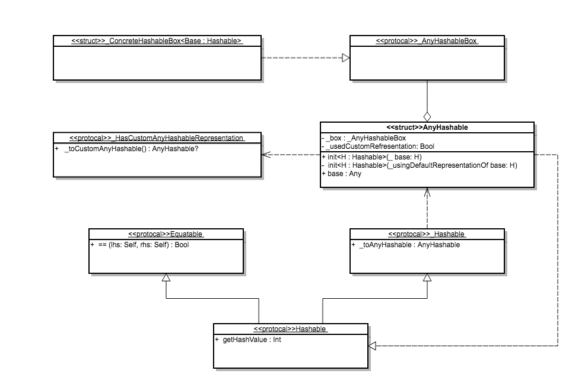

#2. Hashable

##Hashable

可哈希的，只有遵循了协议 Hashable 的对象才可以作为 Dictionary 或者 set 的 key， 相关的约束可以往后看再确定

```
public protocol _Hashable {
  func _toAnyHashable() -> AnyHashable
}


public protocol Hashable : _Hashable, Equatable {
  /// The hash value.
  ///
  /// Hash values are not guaranteed to be equal across different executions of
  /// your program. Do not save hash values to use during a future execution.
  var hashValue: Int { get }
}
```

- hashValue   

	遵循 Hashable 的对象必须提供一个 Int 类型的 hashValue。
	
	如果两个对象 a 和 b，  a == b 为 YES，那么 a.hashValue = b.hashValue 必为 YES， 然而倒过来便不一定，两个对象的 hashValue 相同并不一定代表两个对象是等价的。


- Equatable 

	Hashable 继承 Equatable 协议，所以遵循 Hashable 的对象必须同时实现 Equatable 中定义的方法 `('==')`，用于判断两个对象是否相等
	
	
- _Hashable 

	看修改记录这个协议是后来加的，并且有一个 toAnyHashable -> AnyHashable 的方法， 它存在的意义是用来区分不同的 Hashable 的类型， 用于定义一个假的 Dictionary<AnyHashable, *> 的下标。
	
	暂时没有理解其作用，可以往下看再深究
	


另 Hashable 的协议文件中还定义了一个 _RuntimeHelpers 的枚举，并且实现了两个默认扩展

```
public enum _RuntimeHelpers {}

extension _RuntimeHelpers {
  @_silgen_name("swift_stdlib_Hashable_isEqual_indirect")
  public static func Hashable_isEqual_indirect<T : Hashable>(
    _ lhs: UnsafePointer<T>,
    _ rhs: UnsafePointer<T>
  ) -> Bool {
    return lhs.pointee == rhs.pointee
  }

  @_silgen_name("swift_stdlib_Hashable_hashValue_indirect")
  public static func Hashable_hashValue_indirect<T : Hashable>(
    _ value: UnsafePointer<T>
  ) -> Int {
    return value.pointee.hashValue
  }
}
```

源代码中并没有对这些做任何说明，通过查阅资料发现 `@ _silgen_name` 的注解用于编译器内部使用，是提供给 C 层的接口，正常情况下开发者都不用关心。
猜测继续往下看应该也能看到很多类似的代码，先跳过。

##AnyHashable

AnyHashabe -> A type-erased hashable value
即类型擦除的可哈希的值   

用 AnyHashable 可以泛化类型，也就是一个 字典、集合的键 可以为 AnyHashable， 具体参考 `Hashable.playground`


Hashable 协议同时还继承了 _Hashable 协议，这个协议的实际作用就是将 可哈希的值转换成类型擦除的 AnyHashable。 


在 AnyHashable 这个文件中，定义了 _Hashable 的协议扩展

```
extension Hashable {
  public func _toAnyHashable() -> AnyHashable {
    return AnyHashable(self)
  }
}
```

也就是说将任何值（对象）类型擦除，只需要调用 AnyHashable 的初始化方法，传入自己。
接下来我们来看一看 AnyHashable 这个结构体。


###<< Struct >>AnyHashable

AnyHashable 是一个结构体，它有两个私有属性

```
//装箱
internal var _box: _AnyHashableBox
internal var _usedCustomRepresentation: Bool
```


AnyHashable 对外暴露一个唯一的初始化方法

```
public init<H : Hashable>(_ base: H) {
   	 //两种情况，如果该对象实现了 _HasCustomAnyHashableRepresentation， 使用该对象的customAnyHashable 来构造（自定义构造），标记usedCustomRepresentation为 YES， 具体见下方 HasCustomAnyHashableRepresentation 中的描述

    if let customRepresentation =
      (base as? _HasCustomAnyHashableRepresentation)?._toCustomAnyHashable() {
      self = customRepresentation
      self._usedCustomRepresentation = true
      return
    }
	 //否则就调用 _ConcreteHashableBox() 使用默认类型为0的 Int 来构造 box，并且标记 _usedCustomRepresentation 为 NO 
    self._box = _ConcreteHashableBox(0 as Int)
    self._usedCustomRepresentation = false
    _stdlib_makeAnyHashableUpcastingToHashableBaseType(
      base,
      storingResultInto: &self)
  }

```


###_AnyHashableBox 
```
internal protocol _AnyHashableBox {
  var _typeID: ObjectIdentifier { get }
  func _unbox<T : Hashable>() -> T?

  //这个方法用于比较箱子中的值是否相同，如果返回nil，则代表类型不同，无法进行比较，否则就使用==进行比较
  func _isEqual(to: _AnyHashableBox) -> Bool?
  var _hashValue: Int { get }

  var _base: Any { get }
  func _downCastConditional<T>(into result: UnsafeMutablePointer<T>) -> Bool
}
```

###<< struct >> _ConcreteHashableBox< Base : Hashable >

定义了一个结构体 _ConcreteHashableBox 并且其封装类型必须是 Hashable 
_ConcreteHashableBox 实现 _AnyHashableBox 协议，用于封装任何 Hashable 的对象，供 AnyHashable 持有。


###HasCustomAnyHashableRepresentation
```
public protocol _HasCustomAnyHashableRepresentation {
  /// Returns a custom representation of `self` as `AnyHashable`.
  /// If returns nil, the default representation is used.
  func _toCustomAnyHashable() -> AnyHashable?
}
```

HasCustomAnyHashableRepresentation，提供了用户自定义对象转换成AnyHashable的方式，结合AnyHashable的初始化方法便可以直接理解，如果该对象实现了HasCustomAnyHashableRepresentation协议，会优先使用其_toCustomAnyHashable返回的 AnyHashable 来作为其 泛化后的值


##总结

Hashable 的这个协议代表可哈希， 实现该协议的对象可以作为`字典`或者`集合`的 Key 使用

对象实现 Hashable 协议除了提供该协议本身所需要的 hashValue 外，还必须实现 Equatable 所需要的 `==` 运算符， 可哈希的必然是可比较的。

Hashable 协议还继承了 _Hashable 协议， 用于将对象泛化为一个 AnyHashable 对象（结构体），并且 stdlib 中已经提供了默认实现即 AnyHashable(Self) 

AnyHashable 是一个结构体，该结构体有两个属性，一个是 协议 _AnyHashableBox 类型的 box， 用于将 base 对象封装， 另一个是一个标志位 _usedCustomRepresentation， 为 Bool 类型

开发者可以让对象实现 _HasCustomAnyHashableRepresentation 来提供自定义的 AnyHashable 实现， AnyHashable 在将对象作为参数构造自身的时候会优先检查该对象是否实现了_HasCustomAnyHashableRepresentation，如果实现，直接使用_HasCustomAnyHashableRepresentation所返回的 AnyHashable来构造，并且将_usedCustomRepresentation置为 YES




