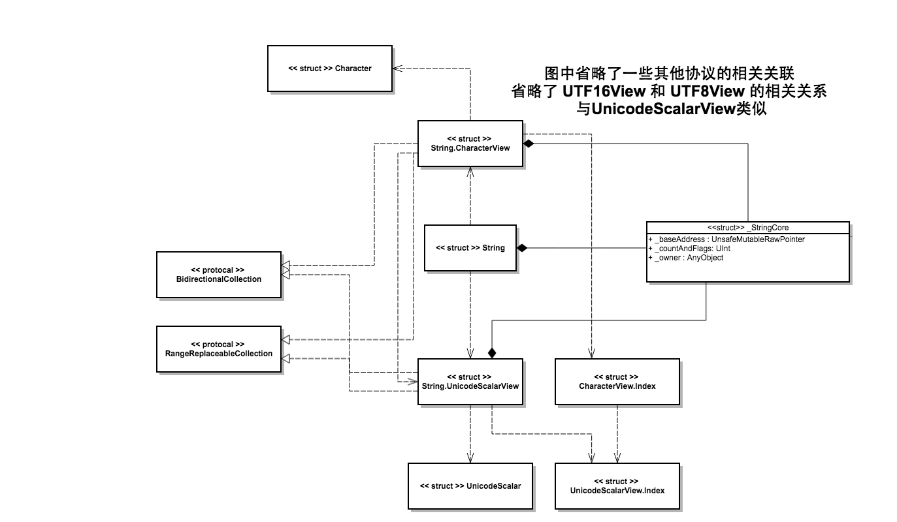

#Swift 3.0 标准库阅读笔记——String

请配合 String.playground

##用法简介
首先先讲讲 String 的一些基本用法


Swift 中的 String 是一个 Unicode 的字符串值（struct）  
Swift 中的 String 可以和 Objective-C 中的 `NSString` 相互桥接，很多时候将 `String` 转换成 `NSString` 来做一些针对字符串的处理会更加方便。

Swift 中的 String 还可以很完美地和 C 层进行交互，实现了一些 C 层次的 API，并且结果完全一致。

###创建
- string literals  字符串构建，最简单的构建方式  


```
let greeting = "Welcome!"
```

- string interpolation 插值构建

```
let name = "Rosa"
let personalizedGreeting = "Welcome, \(name)!"
```

###修改
String 为值类型（struct），修改一个 string 的拷贝，原来的不会被影响。

```
var otherGreeting = greeting
otherGreeting += " Have a nice time!"
print(otherGreeting)
//Prints "Welcome! Have a nice time!"
print(greeting)
// Prints "Welcome!"  原来的不受影响
```

###比较 
String 比较的不是字面值，而是标准化为 Unicode 的值

```
let cafe1 = "Cafe\u{301}"
let cafe2 = "Café"
print(cafe1 == cafe2)
// Prints "true"  最后的值为 true
```
unicode `\u{301}` 做的就是把前一个字符做一个升调，可以看到，这两个字符串是相等的。

String 类型是不受 Locale 影响的。 


###视图

String 本身是不可迭代的，但是实际上在 Swift 中可以对 String 做下标操作（下标类型为 String.Index ），这是依靠 String 的视图来实现的。

- Character View  字符串视图 

```
let cafe = "Cafe\u{301} du 🌍"
print(cafe.characters.count)
// Prints "9" 注意， string.characters 返回的是一个 CharacterView 不是一个 Array
print(Array(cafe.characters))
// Prints "["C", "a", "f", "é", " ", "d", "u", " ", "🌍"]"
```

- Unicode ScalarView （UTF-32 View)

```
print (cafe.unicodeScalars.count)  
// Print "10" 
print (Array(cafe.unicodeScalars))
// Prints "["C", "a", "f", "e", "\u{0301}", " ", "d", "u", " ", "\u{0001F30D}"]"

print(cafe.unicodeScalars.map { $0.value })
//Prints "[67, 97, 102, 101, 769, 32, 100, 117, 32, 127757]"
```
差别很明显，Character View 是用户可识别的，针对用户的， Unicode ScalarView 直接显示 Unicode·标量， `é` 由两个 Unicode 组成，所以前者为9 后者为 10， `🌍`  在 Unicode ScarlarView 中直接显示为 32位 的 Unicode 值

- UTF-16 View  

相比 Unicode ScalarView, UTF-16 显示的是 16位 的 Unicode 

```
print(cafe.utf16.count)
// Prints "11"
print(Array(cafe.utf16))
// Prints "[67, 97, 102, 101, 769, 32, 100, 117, 32, 55356, 57101]"
```

可以看到，最后一个字符  "🌍" 被分割成了两个 UTF-16 字符

```
print(Array("🌍".utf16))
//[55356, 57101]
print(Array("🌍".unicodeScalars))
//["\u{0001F30D}"]
```

值得一提的是，之前提过 String 和 NSString 之间可以直接进行桥接，那么将刚才那个字符转换成 NSString 后再调用其 length 会获得多大的长度值呢？

```
let nscafe = cafe as NSString
print (nscafe.length)
// Prints 11
print(nscafe.character(at: 10))
// Print  57101
```

所以 NSString 用的是 UTF-16 的编码方式

- UTF-8 View

```
print(cafe.utf8.count)
//Prints "14"
print(Array(cafe.utf8))
//240, 159, 140, 141]"

let cLength = strlen(cafe)
print(cLength)
//Prints "14"
```

strlen 是 C 层次的 API， 所以可以看到 C 中 String 是采取 UTF-8 编码的


##视图的选择

为什么 Swift 中 String 要使用视图？ 我们选择什么样的视图取决于使用的用途。 不同的视图导致 String 返回不同的长度。

一个是用途考虑：用于用户显示，针对用户而言，肯定是 characterView

另一个是考虑兼容： 如果需要和 C 交互 或者转换成了 NSString ，则需要具体情况具体考虑。

##IsEmpty

一个小细节，如果想要判断字符串是否为空， 不要调用 `views.count` ，调用 `isEmpty` ，前者会有一个 O(n) 的时间消耗，会遍历一遍。

##


##String 元素访问

我们没有办法直接通过 cafe[i] 来获取到 cafe 的第 i 个元素（ i 为一个 Int ） 

必须使用 String.Index 下标  

```
let index = cafe.characters.index(cafe.startIndex, offsetBy: 8)
print(cafe[index])
//Print "🌍"
```

可以看到，直接对 String 做下标访问，使用的是 CharacterView

再看一个官方例子：

```
let name = "Marie Curie"
let firstSpace = name.characters.index(of: " ")!
let firstName = String(name.characters.prefix(upTo: firstSpace))
print(firstName)
//Prints "Marie"
```

通过 `name.characters.index(of: " ")` 获得第一个空白字符的 Index（类型为 String.Index），String(characterView) 可以将 CharacterView 转换成 String。

Index 是可以相互转换的，同一个字符，在 CharacterView 和 UTF-8 View中很可能位置不同，我们使用下面的方式来进行转换：
```
let firstSpaceUTF8 = firstSpace.samePosition(in: name.utf8)
print(Array(name.utf8.prefix(upTo: firstSpaceUTF8)))
//Prints "[77, 97, 114, 105, 101]"
```


其他 API 可以阅读官方文档~ 下面进入源码阶段！

##源码阅读
###<< struct >> String


String的结构体本身非常简单。

```
public struct String {
  /// Creates an empty string.
  public init() {
    _core = _StringCore()
  }

  public // @testable
  init(_ _core: _StringCore) {
    self._core = _core
  }

  public // @testable
  var _core: _StringCore
}
```

可以看到着手点就在 _StringCore 这个对象， 在 String 文件中并没有找到 `_StringCore` 的定义，剩下的就是 String 的一大堆扩展，先不针对这些扩展做文章，我们来找 `_StringCore`

###<< struct >> _StringCore
我们可以直接找到 StringCore 的文件， 在里面有 _StringCore 对象的定义。 _StringCore 是一个比较底层的结构体，真正定义了 String 的数据结构。它能够存储 ASCII 和 UTF-16， 同时可以包装 _StringBuffer 或者 NSString 实例

_StringCore 主要有三个实例：

 `_baseAddress`,`_countAndFlags`,`_owner`

```
var s: String? = "Foo"
print(s?.characters)
// Optional(Swift.String.CharacterView(_core: Swift._StringCore(_baseAddress: Optional(0x0000000111b220cc), _countAndFlags: 3, _owner: nil)))

var t: String? = "Foo"
print(t?.characters)

// Optional(Swift.String.CharacterView(_core: Swift._StringCore(_baseAddress: Optional(0x0000000111b220cc), _countAndFlags: 3, _owner: nil)))

t = t! + " Hello"
print(t?.characters)
//Optional(Swift.String.CharacterView(_core: Swift._StringCore(_baseAddress: Optional(0x00006180000595b0), _countAndFlags: 9, _owner: Optional(Swift._HeapBufferStorage<Swift._StringBufferIVars, Swift.UInt16>))))
print(s?.characters)
//Optional(Swift.String.CharacterView(_core: Swift._StringCore(_baseAddress: Optional(0x00000001103ab0cc), _countAndFlags: 3, _owner: nil)))

```

所以至少可以看到 `_baseAddress`指的是 字符串对应的地址指针， `_countAndFlags` 代表长度 , `owner`暂时不知道干嘛的 =.= 待议。但是

这里两个String对象的 baseAddress 指向了同一个指针，所以有必要解释下 String 的内存管理机制。


在 Swift 中， String 使用的是 copy-on-write 的策略将数据存储在 buffer 中，并且 buffer 是可以共享的， 以上述代码为例， 一开始 "Foo" 这个字符串在缓存区中是不存在的，会新建 "Foo" 这块缓存， 定义 t 的时候在缓存区找到了 "Foo" 便直接将 _baseAddress 指向 "Foo"， 当修改 String 值的时候， 会重新指向一个新的地址。

在 _StringCore 这个文件中，同样定义了许多方法，同时 _StringCore 也实现了不少协议，这些我们先跳过，因为 _StringCore 这个对象在实际开发中基本不会使用到， 我们可以在之后涉及到 String 的一些操作的时候回过头看这些方法。


###<< struct >> String.CharacterView

接着我们来看一下 String 的不同视图， 首先是最常用到的 CharacterView。

String 本身不是一个 Sequence 或者 Collection，所以如果要对 String 中的字符做操作，需要借助其视图，比如 characters


```
extension String {
  public struct CharacterView {
    internal var _core: _StringCore
    internal var _coreOffset: Int
    public init(_ text: String) {
      self._core = text._core
      self._coreOffset = 0
    }
    public // @testable
    init(_ _core: _StringCore, coreOffset: Int = 0) {
      self._core = _core
      self._coreOffset = coreOffset
    }
  }
  public var characters: CharacterView {
    get {
      return CharacterView(self)
    }
    set {
      self = String(newValue)
    }
  }
  public init(_ characters: CharacterView) {
    self.init(characters._core)
  }
}

```

CharacterView 是一个 String 的内部结构体，有两个私有属性： `_core:_StringCore`,`_coreOffset: Int`， String 定义了一个获取其 CharacterView 的方法，实际上就是调用了 `CharacterView(self)` 可以看到， 每次调用 characters 都会重新生成一个 CharacterView， 而 CharacterView 的构造方法实际上是复制了 String 的 _core， 注意，因为 _StringCore 是结构体，所以这里是拷贝。 而 characters 的 set 方法实际上替换了 String 本身。


下面介绍一个在这个结构体定义的时候唯一涉及到的一个功能性质的方法

```
public mutating func withMutableCharacters<R>(
_ body: (inout CharacterView) -> R
) -> R {
// Naively mutating self.characters forces multiple references to
// exist at the point of mutation. Instead, temporarily move the
// core of this string into a CharacterView.
	var tmp = CharacterView("")
	swap(&_core, &tmp._core)
	let r = body(&tmp)
	swap(&_core, &tmp._core)
	return r
}
```
使用一个临时的 CharacterView 作为 tmp， 交换 tmp 和 String 的 _core， 然后对 tmp 做一些操作， 做完之后再交换回来， 那么 String 的 _core 已经是被处理过的了。 函数返回的是这个闭包的返回值。

```
var str = "All this happened, more or less."
let afterSpace = str.withMutableCharacters { chars -> String.CharacterView in
	if let i = chars.index(of: " ") {
  		let result = chars.suffix(from: chars.index(after: i))
		chars.removeSubrange(i..<chars.endIndex)
		return result
  }
  return String.CharacterView()
  }
print(str)
// Prints "All"
print(String(afterSpace))
// Prints "this happened, more or less."
```


之前也提过， String 本身不是一个集合不可被遍历， 而 CharacterView 实现了 `BidirectionalCollection` 协议，是一个集合，可遍历。

在实现中， 定义了 String.CharacterView.Index 这个对象，即 CharacterView 的下标，这个下标首先是 `Comparable` 的，调用 CharacterView 的下标方法 `[]` 中必须是一个 `String.CharacterView.Index` 对象而不是一个 `Int` 值。

`String.CharacterView.Index` 是基于 `String.UnicodeScalarView.Index`的，它有一个类型为 `String.UnicodeScalarView.Index` 的 base 实例， 附带一个 _countUTF16 的偏移量， 我们可以以之前的"🌍"，它是两个 UTF-32 字符，但是是一个 Character，所以一个 base 和一个 count 就可以解决 UnicodeScalarView.Index 到 CharacterView.Index 的转换。

我们可以猜测， UnicodeScalarView.Index 一定也是采用了类似的设计。

事实上，不同视图的 Index 是可以相互转换的，使用 `samePosition(in)` 方法。具体的代码如下：

```
let hearts = "Hearts <3 ♥︎ 💘"
if let i = hearts.characters.index(of: " ") {
	 let j = i.samePosition(in: hearts.utf8)
	 print(Array(hearts.utf8.prefix(upTo: j)))
}
// Prints "[72, 101, 97, 114, 116, 115]"
```


调用 CharacterView 的下标方法返回的是一个 Character 类型的对象， 并且通过 UnicodeScalars来进行构造的。 

关于 `Character` 类型， `Character` 可以由一个或多个 Unicode 组成， `Character` 是一个可以直接展示给用户的字符，对于用户来说，它是一个字符， 但是很多情况下，它实际上由多个 Unicode 字符组成。

`Character` 比较重要的一个属性是 `_representation` ，这是一个枚举类型，

```
@_versioned
internal enum Representation {
// A _StringBuffer whose first grapheme cluster is self.
// NOTE: may be more than 1 Character long.
case large(_StringBuffer._Storage)
case small(Builtin.Int63)
}
```

所有的 UTF-8 字符都可以用63位的Int来表示，也就是大部分情况下就是 small， 但是非 UTF-8就会使用 large(_StringBuffer._Storage) 来表示，它完全有可能超过 1 个字符。


CharacterView 同时还实现了协议 `RangeReplaceableCollection`, 可以从字面理解，这是一个代表 可以使用 Range 来替换部分的 Collection， 我们不做深究。

通过阅读 CharacterView 的源码，可以发现几乎所有的操作都是借助于 UnicodeScalarView 来做的， 就不得不去看看 UnicodeScalarView 的对应操作。

###<< struct >> String.UnicodeScalarView

我们可以猜测 UnicodeScalarView 应该拥有和 CharacterView 类似的功能， 是一个 `BidirectionalCollection` 和一个  `RangeReplaceableCollection` ，打开 StringUnicodeScalarView.swift， 的确，它实现了这两个协议，而且它也同样持有一个和对应 String相同的_StringCore，但是具体的实现和我的猜测有所出入。


我们只讲它和 `String.CharacterView` 不同的地方， 从表现上我们已经知道， `UnicodeScalarView` 代表的是 UTF-32， 而一个 `Character` 可能由多个 `UTF-32` 组成。

从实现上，`CharacterView` 的相关集合、下标操作都是依赖于 `UnicodeScalarView` 的， 并且`CharacterView.Index`也是通过 `UnicodeScarlarView.Index` 来进行相关操作，但是 `UnicodeScalarView.Index` 并不是我所预想的依赖于 `UTF16View.Index`, 而是依赖于 _StringCore。

`UnicodeScalarView.Index` 仅有一个 Int 类型的属性 `_position` 即位置，这也很好理解，因为每个 `UnicodeScalar` 的长度是固定的，即32位，所以一个位置足矣，自然也就不需要依赖于其他的 `View`.

`UnicodeScalarView` 中定义了一个迭代器 `_ScratchIterator` 负责对 `_core` 进行迭代，从而完成 `UnicodeScalarView` 的下标操作， 可以想象一下，对于 _core的 baseAddress 做对应的位操作就可以获取到了。

同`CharacterView`和`Character` 一样， `UnicodeScalarView` 也有自己的 `UnicodeScalar`，实际上就是一个 UTF-32。

在 StringUnicodeScalarView.swift 中还定义了关于 UnicodeScalarView.Index 和其他视图的 Index 相互转换的扩展方法。


### 其他视图

`UTF16View` 和 `UnicodeScalarView` 类似，值得一提的是，`_StringCore`本身提供了下标方法获取 UTF16.CodeUnit，而并没有扩展更多其他的下标，所以对于 `UTF16View`来说，可以基于`_core`的下标操作来完成对应的集合相关操作。

`UTF8View` 对 `_StringCore` 进行了扩展，定义了一个`_UTF8Chunk`的别名（实际上是一个UInt64)，即一个 `UTF8` 块， `UTF8.Index`中除了有一个`Int`类型的 coreIndex 外，直接存了一个 `_UTF8Chunk` 的 Buffer ，（索引里直接存值真是有创意，但是对于 UTF8 来说似乎是个好主意）

### 其他扩展

- StringBridge 定义了和 NSString 之间的桥接
- StringComparable 定义了针对 String 的比较方法，可以发现时基于 ASCII 码的
- StringHashable 完成了 String 的哈希策略
- StringIndexConversions 定义了 String 不同 View 的 Index 的相互转换
- StringLegancy 定义了 String 的一些扩展方法，比如 hasPrefix、hasSuffix、repeat的初始化方法等等
- 等等等等


### StringBuffer

关于 `StringBuffer`， 其实这对于理解 `String` 的内存管理机制比较重要，简单看了下， `StringBuffer` 主要是一个属性——`_Storage` ，他是一个 `HeapBuffer`， 关于 `HeapBuffer`，又有很多东西要讲，我准备放到下次再来研究下 `StringBuffer`


##总结
先上一张图：



图中描述了 关于 String 的一些比较关键的关系，包括协议、结构体，省略了一些其他的协议，比如 Equatable，Comparable 等等，也省略了部分视图（UTF16、UTF8)（都画上要乱套了）


首先 `String` 是一个结构非常简单的结构体，只持有一个 `_StringCore` 的结构体，于是关于 `String` 的所有内容都封装在 `_StringCore` 上， 这是一个比较好的设计，`_StringCore` 是一个私有对象，直接隔离了 `String` 的所有内部结构（使用者并不关心），这样既安全又方便扩展。

`_StringCore` 包含三个属性， `_baseAddress` （ 指针地址，指向堆中的目标字符串） `_countAndFlags`（字符串长度）, `_owner` 用途位置，希望在下一次看 `StringBuffer`的时候能够看出端倪，目前线索就指向 `StringBuffer`。

关于`String`的内存回收机制：copy-and-write、基于堆，重复利用。 在下一章 `StringBuffer` 中应该会对这块机制做更进一步的了解。

`String` 视图， `String` 有 4 个视图， `CharacterView` `UnicodeScalarView` `UTF16View` `UTF8View`， `String`并不持有视图，每次调用的时候会重新创建视图（复制_core)，不同的视图拥有对应类型的索引（Index），索引之间可以相互转换， 视图是 `Collection` 可遍历、可取下标，而 `String` 不行。


